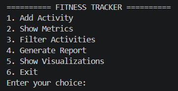
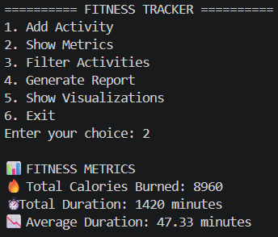
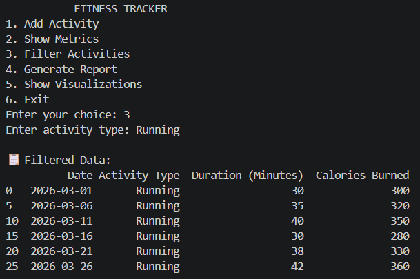
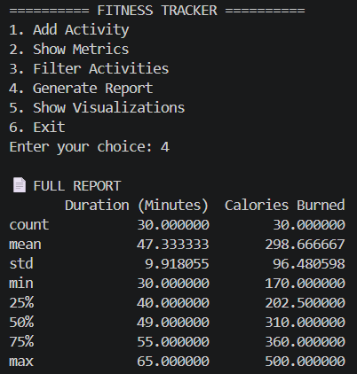
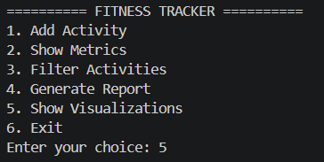
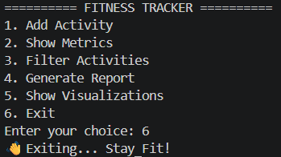

# 🏋️ Personal Fitness Tracker Dashboard  

---

## 🚀 Project Overview

The **Personal Fitness Tracker Dashboard** is a data-driven application developed using Python to monitor, analyze, and visualize daily fitness activities. The system is designed to simulate a real-world fitness tracking environment where users can record their workouts and gain meaningful insights from their data.

This project focuses on transforming raw fitness inputs such as activity type, duration, and calories burned into structured information that can be processed and analyzed efficiently. By leveraging data analysis and visualization techniques, the system provides users with a clear understanding of their fitness patterns and performance trends.

The application integrates multiple programming concepts including structured logic, modular design, and data handling techniques. It demonstrates how simple user input can be converted into actionable insights through proper processing and visualization.

Overall, the project reflects the practical implementation of programming in solving real-life problems, especially in the domain of health and fitness tracking.

---
## 🧠 Core Workflow

The system operates on a well-defined workflow that ensures smooth data handling and meaningful output generation. The entire process is structured into multiple stages:

### 🔹 1. Data Input
The workflow begins with user interaction. The user provides details such as activity type, duration, and calories burned. Input validation is performed to ensure that the data entered is logical and valid.

### 🔹 2. Data Storage
The entered data is stored in a CSV file, which acts as a lightweight database. This allows persistent storage of records and enables future access for analysis.

### 🔹 3. Data Processing
Once stored, the data is processed using computational techniques. Numerical operations are performed to calculate key metrics such as total calories burned, average duration, and total time spent on activities.

### 🔹 4. Data Analysis
The system allows filtering and summarizing of data. Users can view specific activity types and analyze trends within the dataset. Statistical summaries provide deeper insights into performance.

### 🔹 5. Data Visualization
Processed data is converted into graphical representations such as bar charts, line graphs, pie charts, and heatmaps. These visualizations help users understand patterns and correlations more effectively.

This workflow ensures that raw data is systematically transformed into meaningful and visually interpretable insights.

---

## 🖥️ Step-by-Step Application Workflow

The application follows a structured and interactive flow that guides the user through different functionalities:

### 🔹 Step 1: Main Menu
The system starts by displaying a menu with multiple options. This acts as the central navigation point for the user.

### 🔹 Step 2: Activity Logging
Users can input their fitness activity details. The system validates the input and stores it in the dataset.

### 🔹 Step 3: Viewing Metrics
The user can choose to view performance metrics. The system calculates and displays total calories burned, total duration, and average duration.

### 🔹 Step 4: Activity Filtering
Users can filter the dataset based on a specific activity type. This allows focused analysis of particular workouts.

### 🔹 Step 5: Report Generation
The system generates a statistical summary of the dataset, including measures such as mean, minimum, maximum, and distribution.

### 🔹 Step 6: Data Visualization
Users can generate graphical representations of the data. Different types of charts provide insights into trends, distributions, and relationships.

### 🔹 Step 7: Exit
The application provides an option to safely terminate the program after completing operations.

This step-by-step workflow ensures a smooth user experience while maintaining clarity and efficiency in data handling and analysis.
### 🎛️ Step 1: Main Menu

The user is presented with multiple options to interact with the system.

---

### 🔥 Step 2: View Fitness Metrics

Displays:
- Total Calories Burned  
- Total Duration  
- Average Duration  

---

### 🔍 Step 3: Filter Activities

Allows filtering of specific activity types for focused analysis.

---

### 📄 Step 4: Generate Report

Shows statistical summary including:
- Mean  
- Min / Max  
- Percentiles  

---

### 📊 Step 5: Visualization Menu

User selects visualization option to view graphical insights.

---

## 📈 Step 6: Graph Outputs

---

### 📊 Time Spent on Activities (Bar Chart)

.png)

---

### 📈 Calories Burned Over Time (Line Graph)

.png)

---

### 🥧 Activity Distribution (Pie Chart)

.png)

---

### 🔥 Correlation Heatmap

.png)

---

### 🚪 Step 7: Exit Application

Program exits safely.

---

## ⚙️ Tech Stack

| Technology | Purpose |
|-----------|--------|
| Python 🐍 | Core Programming |
| Pandas | Data Handling |
| NumPy | Calculations |
| Matplotlib | Visualization |
| Seaborn | Advanced Graphs |

---

## 💡 Design Thinking

- Clean and simple interface  
- Step-by-step interaction  
- Data-driven insights  
- Easy to scale and improve  

---

## 🌍 Real-World Applications

- Fitness tracking apps 📱  
- Health monitoring systems 🏥  
- Athlete performance tools 🏃  
- Data dashboards 📊  

---

## 🏁 Final Thought

---

💪 Stay Fit | 📊 Stay Data-Driven
